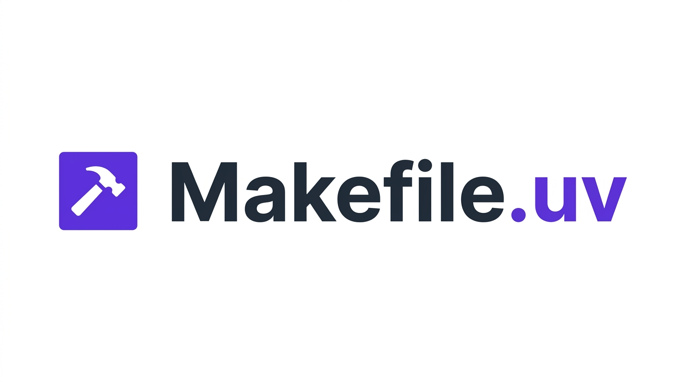

<p align="center">
  
</p>

<p align="center">
  A reusable, include-based Makefile that gives any Python project a
  <a href="https://docs.astral.sh/uv/">uv</a>-backed test orchestration
  layer. Companion to the
  <a href="https://pydevtools.com/">Python Developer Tooling Handbook</a>.
</p>

This README is organized around the
[Diátaxis](https://diataxis.fr/) documentation framework:

1. **[Tutorial](#tutorial-add-makefileuv-to-a-fresh-project)** walks through
   your first setup from scratch.
2. **[How-to guides](#how-to-guides)** solve specific tasks.
3. **[Reference](#reference)** lists every variable and target.
4. **[Explanation](#explanation)** covers the design decisions.

## Tutorial: add Makefile.uv to a fresh project

Start with an empty directory. By the end of this tutorial you'll have a
minimal project that runs tests against two Python versions via `make test-all`.

### Create the project

```console
$ uv init demo
$ cd demo
$ uv add --dev pytest
```

`uv init` creates `pyproject.toml`, `src/demo/__init__.py`, and a `main.py`.
`uv add --dev pytest` records pytest in the dev dependency group.

Write a throwaway test so there's something to run:

```python {filename="tests/test_smoke.py"}
def test_ok():
    assert 1 + 1 == 2
```

### Install Makefile.uv

Pull a pinned version into the project root:

```console
$ curl -sSL https://raw.githubusercontent.com/python-developer-tooling-handbook/makefile.uv/v0.3.0/Makefile.uv -o Makefile.uv
```

Create a `Makefile` that declares which Python versions you want to test and
includes the file:

```makefile
PYTHON_VERSIONS := 3.12 3.13

include Makefile.uv
```

Add the per-version venv directories to `.gitignore`:

```gitignore
.venv
.venv-*
```

### Run the tests

`make sync` creates the default venv and installs dependencies:

```console
$ make sync
```

`make test` runs pytest in that venv:

```console
$ make test
```

`make test-py3.12` runs against Python 3.12 in a dedicated venv at `.venv-3.12`:

```console
$ make test-py3.12
```

`make test-all` runs every version in `PYTHON_VERSIONS`:

```console
$ make test-all
```

### Clean up

```console
$ make clean
```

That removes every `.venv*` directory along with build artifacts and caches.

### What to try next

- Add `FORMAT`, `LINT`, or `TYPECHECK` variables and run `make lint` / `make format` / `make typecheck`.
- Read [How-to: run tests across a dependency matrix](#run-tests-across-a-dependency-matrix)
  to test your project against two incompatible versions of a dependency.

## How-to guides

### Run tests across a dependency matrix

Declare the competing options as extras with a conflict block in `pyproject.toml`:

```toml
[project.optional-dependencies]
pd1 = ["pandas<2"]
pd2 = ["pandas>=2"]

[tool.uv]
conflicts = [
    [{extra = "pd1"}, {extra = "pd2"}],
]
```

Set `DEP_VARIANTS` alongside `PYTHON_VERSIONS`:

```makefile
PYTHON_VERSIONS := 3.11 3.12
DEP_VARIANTS    := pd1 pd2

include Makefile.uv
```

Run `make matrix`. Four cells execute: `3.11 × pd1`, `3.11 × pd2`, `3.12 × pd1`,
`3.12 × pd2`. Each gets its own venv at `.venv-cell-<VER>-<VAR>`.

See [`examples/with-matrix/`](examples/with-matrix/) for a complete working
project.

### Use PEP 735 dependency groups instead of extras

When your variants are development-only, reach for
[PEP 735](https://peps.python.org/pep-0735/) dependency groups. Groups don't
leak into `pip install foo[…]`, so they fit "with feature X vs without" axes
more naturally.

```toml
[dependency-groups]
with-chardet = ["chardet"]
without-chardet = []

[tool.uv]
conflicts = [
    [{group = "with-chardet"}, {group = "without-chardet"}],
]
```

Set `DEP_MODE := group`:

```makefile
DEP_VARIANTS := with-chardet without-chardet
DEP_MODE     := group

include Makefile.uv
```

See [`examples/with-groups/`](examples/with-groups/) for a complete project.

### Swap mypy for ty

Set `TYPECHECK` and add ty to your dev group:

```console
$ uv add --dev ty
```

```makefile
TYPECHECK := ty check

include Makefile.uv
```

`make typecheck` now runs `uv run ty check`.

### Capture per-environment output to log files

`test-all` and `matrix` stream output to stdout. When you want each
environment's output captured separately, pipe through `tee`:

```console
$ make test-py3.12 2>&1 | tee py3.12.log
```

For parallel runs with untangled output, use Make's `--output-sync`:

```console
$ make -j4 test-all --output-sync=target | tee test-all.log
```

### Forward flags to every `uv run`

Set `UV_RUN_FLAGS`. Common values: `--extra cli`, `--group test`, `--with ipython`.

```makefile
UV_RUN_FLAGS := --extra cli

include Makefile.uv
```

Every `uv run` invocation (including implicit syncs inside `test-py<VER>`) picks
up the flags.

### Install `make` on Windows

```console
> choco install make
```

Run commands from Git Bash (ships with Git for Windows) or WSL. Native
`cmd.exe` and PowerShell aren't supported because the matrix cell recipe uses
POSIX-shell tools.

### Keep ruff out of your per-version venvs

Ruff's default excludes cover `.venv` but not `.venv-*`. Add an explicit
exclude in `pyproject.toml`:

```toml
[tool.ruff]
extend-exclude = [".venv-*"]
```

## Reference

### Variables

Overrides apply when set before `include Makefile.uv`, via `make VAR=…`, or in
the environment. Most variables use `?=`. `LINT` is special-cased because GNU
Make has a built-in default `LINT = lint`; Makefile.uv's default takes effect
when the origin is the built-in, and any user override still wins.

| Variable | Default | Purpose |
|---|---|---|
| `PYTHON_VERSIONS` | `3.11 3.12 3.13 3.14` | Versions `test-all` iterates |
| `DEP_VARIANTS` | (empty) | Variant names for the 2-axis matrix. Empty disables `matrix`. |
| `DEP_MODE` | `extra` | Whether variants are `--extra` (PEP 621) or `--group` (PEP 735) |
| `PYTEST` | `pytest` | Test command |
| `LINT` | `ruff check` | Lint command |
| `FORMAT` | `ruff format` | Format command (modifies files; set `ruff format --check` for CI) |
| `TYPECHECK` | `mypy` | Type-check command |
| `UV_VENV_PREFIX` | `.venv-` | Directory prefix for per-version venvs. Must be non-empty. |
| `UV_SYNC_FLAGS` | (empty) | Flags forwarded to `uv sync` |
| `UV_RUN_FLAGS` | (empty) | Flags forwarded to every `uv run` |

### Targets

| Target | Behavior |
|---|---|
| `sync` | `uv sync $(UV_SYNC_FLAGS)` |
| `test` | `uv run $(PYTEST)` in the default venv |
| `test-py<VER>` | `$(PYTEST)` on Python `<VER>` in `$(UV_VENV_PREFIX)<VER>` |
| `test-all` | `test-py<VER>` for each version in `PYTHON_VERSIONS` |
| `matrix` | Every Python × `DEP_VARIANTS` cell |
| `test-cell-py<VER>-<VAR>` | One matrix cell |
| `lint` | `uv run $(LINT)` |
| `format` | `uv run $(FORMAT)` |
| `typecheck` | `uv run $(TYPECHECK)` |
| `clean` | Removes `.venv`, `$(UV_VENV_PREFIX)*`, `dist`, `*.egg-info`, `.pytest_cache` |
| `help` | Prints targets and current variable values |

### Worked examples in this repo

- [`examples/basic/`](examples/basic/): minimal project with pytest, ruff, and mypy in the dev group.
- [`examples/with-matrix/`](examples/with-matrix/): `DEP_MODE=extra` with two conflicting extras.
- [`examples/with-groups/`](examples/with-groups/): `DEP_MODE=group` with two conflicting PEP 735 groups.

### Compatibility

- GNU Make 3.81 and above. macOS's default `/usr/bin/make` satisfies this.
- uv 0.4 and above.
- POSIX shell for the matrix cell recipe. Native `cmd.exe` and PowerShell on Windows aren't supported; Git Bash or WSL is required.
- Tested in CI on `ubuntu-latest`, `macos-latest`, and `windows-latest`.

### Install

```bash
curl -sSL https://raw.githubusercontent.com/python-developer-tooling-handbook/makefile.uv/v0.3.0/Makefile.uv -o Makefile.uv
```

Commit the pulled file alongside your `Makefile`. Committing locks the
version; upgrade by re-running the `curl` with a newer tag.

## Explanation

### Why uv?

uv installs Python versions on demand (`uv run --python 3.12` downloads
CPython 3.12 if it isn't already available) and manages venvs at the same
speed it downloads wheels. That combination is what makes multi-version
testing practical without tox or nox doing the venv bookkeeping. The rest of
the Python toolchain that Makefile.uv cares about (dependency resolution,
sync, run) uv already covers, so there's nothing left for the Makefile to do
other than expose a few targets.

### Why an include-based Makefile instead of a Python package?

tox and nox introduce a new vocabulary (envs, factors, sessions) and live
in your project's Python dependency tree. A Makefile already exists on every
developer machine and CI runner, needs no install, and composes freely with
any other target a project wants to add (`docs`, `deploy`, `db-reset`).
Makefile.uv specifically is a single file: pull it with `curl`, include it,
commit the pinned copy. There's no package to upgrade and nothing to uninstall.

The cost is some Make syntax. The upside is zero runtime footprint.

### Why `FORCE` prereqs on pattern rules?

Make treats a target as up to date when a file of the same name exists and is
newer than its prerequisites. If a user (or a stray shell script) creates a
file named `test-py3.12`, Make would otherwise think the target has already
been built.

Declaring `FORCE:` as an empty phony prerequisite forces pattern-matched
targets to rebuild on every invocation, which is what test orchestration
wants.

### Why does `LINT` need a special `ifeq` block?

GNU Make ships a built-in default `LINT = lint` (for the Unix `lint` tool).
`LINT ?= ruff check` sees the built-in as already defined and skips. The
`ifeq ($(origin LINT),default)` check force-sets Makefile.uv's default only
when the current value came from Make's built-in. A user's override (file,
command line, or environment) bypasses the ifeq and the `?=` below it, so
user intent wins.

### Why `DEP_MODE` rather than separate `DEP_EXTRAS` and `DEP_GROUPS` variables?

PEP 621 extras and PEP 735 groups are parallel concepts. A project's matrix
axis is one or the other, not both at once. A single `DEP_VARIANTS` list plus
a `DEP_MODE := extra|group` toggle keeps the API small. The cell recipe
translates to `uv run --$(DEP_MODE) $$VAR`, which accepts both `--extra` and
`--group` interchangeably.

### Why not just use tox?

tox does more than this Makefile intends to. It runs `commands = …` across
configured environments, resolves dependencies with its own logic, supports
factors and generative envlists, and extends through a plugin system.
Makefile.uv exposes `test-py<VER>` targets and leaves composition to Make,
delegates dependency handling to uv, and has exactly one variable (`DEP_MODE`)
plus one pattern rule for the matrix.

If you need tox's feature set, use tox. Makefile.uv is the 80% solution for
projects where uv's multi-version Python support and a POSIX pattern rule are
enough.

### Why was `LOG_DIR` removed in v0.3?

v0.2 shipped a `LOG_DIR` variable that tee'd each environment's output to a
per-env log file. The feature required `set -o pipefail`, which in turn
required upgrading `SHELL` to `/bin/bash`, which triggered a cascade of
conditional logic (dash detection, SHELL scoping, split recipes, additional
validation in `clean`). The whole feature accounted for roughly a third of
the Makefile's complexity.

The replacement is a shell pipe: `make test-py3.12 2>&1 | tee py3.12.log`.
For parallel runs, Make's own `--output-sync=target` untangles streams
without any Makefile.uv machinery. The savings in clarity outweighed the
small convenience of a built-in log directory.

## License

MIT. See [LICENSE](LICENSE).
